# d3-dag

Often data sets are hierarchical, but are not in a tree structure, such as genetic data.
In these instances `d3-hierarchy` may not suit your needs, which is why `d3-dag` (Directed Acyclic Graph) exists.
This module implements a data structures for manipulating DAGs that mimics the API of `d3-hierarchy` as much as possible.


## Installing

If you use NPM, `npm i d3-dag`.
Otherwise you can load it using `unpkg`:

```html
<script src="https://unpkg.com/d3-dag"></script>
<script>

var dag = d3.sugiyama();

</script>
```

- [Try d3-dag in your browser](https://tonicdev.com/npm/d3-dag)
- [Some examples](https://beta.observablehq.com/collection/@bumbeishvili/d3-dag)

## API Reference

* [Hierarchy](#hierarchy)
* [Stratify](#stratify)
* [DAG](#dag)
* [Sugiyama](#sugiyama)


### Hierarchy

Before you can compute a DAG layout, you need a DAG structure.
If your data is already in a DAG structure, you can pass it directly to [`d3.dierarchy`](#dierarchy); otherwise, you can rearrange tabular data into a DAG using [`d3.dratify`](#dratify)

<a name="dierarchy" href="#dierarchy">#</a> d3.**dierarchy**() [<>](https://github.com/erikbrinkman/d3-dag/blob/master/src/dag/hierarchy.js#L5 "Source")

Constructs a new hierarchy operator with the default settings.

<a name="_dierarchy" href="#_dierarchy">#</a> dierarchy(...*roots*) [<>](https://github.com/erikbrinkman/d3-dag/blob/master/src/dag/hierarchy.js#L9 "Source")

Construct a DAG from the specified root nodes.
Each root node must be an object representing a root node.
For example:

```json
{
  "id": "Eve",
    "children": [
    {
      "id": "Cain"
    },
    {
      "id": "Seth",
      "children": [
      {
        "id": "Enos"
      },
      {
        "id": "Noam"
      }
      ]
    },
    {
      "id": "Abel"
    },
    {
      "id": "Awan",
      "children": [
      {
        "id": "Enoch"
      }
      ]
    },
    {
      "id": "Azura"
    }
  ]
}
```

The DAG must be connected, i.e. each roots descendants must overlap.
Node ids must be unique, and can't contain the null character `'\0'`.

<a name="dh_id" href="#dh_id">#</a> dierarchy.**id**([*id*]) [<>](https://github.com/erikbrinkman/d3-dag/blob/master/src/dag/hierarchy.js#L38 "Source")

If *id* is specified, sets the id accessor to the given function and returns this dierarchy operator.
Otherwise, returns the current id accessor, which defaults to:

```js
function id(d) {
  return d.id;
}
```

<a name="children" href="#children">#</a> dierarchy.**children**([*children*]) [<>](https://github.com/erikbrinkman/d3-dag/blob/master/src/dag/hierarchy.js#L42 "Source")

If *children* is specified, sets the children accessor to the given function and returns this dierarchy operator.
Otherwise, returns the current children accessor, which defaults to:

```js
function children(d) {
  return d.children;
}
```


### Stratify

You can rearrange tabularesque data into a DAG using [`d3.dratify`](#dratify).

<a name="dratify" href="#dratify">#</a> d3.**dratify**() [<>](https://github.com/erikbrinkman/d3-dag/blob/master/src/dag/stratify.js#L5 "Source")

Constructs a new stratify operator with the default settings.

<a name="_dratify" href="#_dratify">#</a> dratify(data) [<>](https://github.com/erikbrinkman/d3-dag/blob/master/src/dag/stratify.js#L9 "Source")

Construct a dag from the specified *data*.
The data should be an array of data elements that contain info about their parents' ids.
For example:

```json
[
  {
    "id": "Eve"
  },
  {
    "id": "Cain",
    "parentIds": ["Eve"]
  },
  {
    "id": "Seth",
    "parentIds": ["Eve"]
  },
  {
    "id": "Enos",
    "parentIds": ["Seth"]
  },
  {
    "id": "Noam",
    "parentIds": ["Seth"]
  },
  {
    "id": "Abel",
    "parentIds": ["Eve"]
  },
  {
    "id": "Awan",
    "parentIds": ["Eve"]
  },
  {
    "id": "Enoch",
    "parentIds": ["Eve"]
  },
  {
    "id": "Azura",
    "parentIds": ["Eve"]
  }
]
```

<a name="ds_id" href="#ds_id">#</a> dratify.**id**([*id*]) [<>](https://github.com/erikbrinkman/d3-dag/blob/master/src/dag/stratify.js#L43 "Source")

If *id* is specified, sets the id accessor to the given function and returns this dratify operator.
Otherwise, returns the current id accessor, which defaults to:

```js
function id(d) {
  return d.id;
}
```

<a name="parentIds" href="#parentIds">#</a> dratify.**parentIds**([*parentIds*]) [<>](https://github.com/erikbrinkman/d3-dag/blob/master/src/dag/stratify.js#L47 "Source")

If *parentIds* is specified, sets the parentIds accessor to the given function and returns this dratify operator.
Otherwise, returns the current parentIds accessor, which defaults to:

```js
function parentIds(d) {
  return d.parentIds;
}
```


### DAG

A DAG is simply a collection of nodes, defined by every reachable child node from the current returned node.
If a DAG contains multiple roots, then the returned node will be special in that it will have an `undefined` `id` and `data` and will be ignored when calling normal methods.
Each child of this special returned node will be one of the roots of the DAG.
Each child node on its own will function as a valid DAG with a single root.
Each node has the following properties:

* *node*.id - a unique string identification for each node.
  This is necessary in order to check if two nodes are identical.
  For internal purposes, ids may not contain the null character (`'\0'`).
* *node*.data - the associated data as specified in the constructor.
* *node*.children - an array of all child nodes. Empty if this is a leaf.

Each node also has the following methods.

<a name="descendants" href="#descendants">#</a> node.**descendants**() [<>](https://github.com/erikbrinkman/d3-dag/blob/master/src/dag/descendants.js#L2 "Source")

Return an array of all descendant nodes of this node.

<a name="links" href="#links">#</a> node.**links**( [<>](https://github.com/erikbrinkman/d3-dag/blob/master/src/dag/links.js#2 "Source"))

Returns an array of every link in the DAG.
Each link has the following properties:

* *link*.source - a node that is a parent of target.
* *link*.target - a node that is a child of source.
* *link*.data - an object with data attached to the link.
  Modifying this object will preserve the data for that link.

<a name="copy" href="#copy">#</a> node.**copy**() [<>](https://github.com/erikbrinkman/d3-dag/blob/master/src/dag/index.js#L30 "Source")

Copies the dag structure and returns it.
The data associated with every node is not copied.

<a name="reverse" href="#reverse">#</a> node.**reverse**() [<>](https://github.com/erikbrinkman/d3-dag/blob/master/src/dag/index.js#L55 "Source")

Copy and reverse the DAG, returning a new root or pseudo root depending on if there are multiple roots.
This is particularly useful if you want to use the opposite accessor in DAG creation.
For example, if your data set has childIds, you can use *dratify* with parentIds and simply reverse the DAG post creation.

<a name="count" href="#count">#</a> node.**count**( [<>](https://github.com/erikbrinkman/d3-dag/blob/master/src/dag/count.js#L2 "Source"))

Set the *value* of each node to be the number of descendants including itself.

<a name="depth" href="#depth">#</a> node.**depth**() [<>](https://github.com/erikbrinkman/d3-dag/blob/master/src/dag/depth.js#L3 "Source")

Set the *value* of each node to be zero if its a root node, or the greatest distance to any root node for other nodes.

<a name="height" href="#height">#</a> node.**height**() [<>](https://github.com/erikbrinkman/d3-dag/blob/master/src/dag/height.js#L3 "Source")

Set the *value* of each node to be zero if its a leaf node, or the greatest distance to any leaf node for other nodes.

<a name="each" href="#each">#</a> node.**each**(*function*) [<>](https://github.com/erikbrinkman/d3-dag/blob/master/src/dag/eachDepth.js#L5 "Source")

Invoke the specified *function* on each node in an arbitrary order.

<a name="eacha" href="#eacha">#</a> node.**eachAfter**(*function*) [<>](https://github.com/erikbrinkman/d3-dag/blob/master/src/dag/eachAfter.js#L2 "Source")

Invoke the specified *function* on each node such a node is called before any of its parents.

<a name="eachb" href="#eachb">#</a> node.**eachBefore**(*function*) [<>](https://github.com/erikbrinkman/d3-dag/blob/master/src/dag/eachBefore.js#L2 "Source")

Invoke the specified *function* on each node such a node is called before any of its children.

<a name="eachbr" href="#eachbr">#</a> node.**eachBreadth**(*function*) [<>](https://github.com/erikbrinkman/d3-dag/blob/master/src/dag/eachBreadth.js#L4 "Source")

Invoke the specified *function* on each node in breadth first order.

<a name="equals" href="#equals">#</a> node.**equals**(*that*) [<>](https://github.com/erikbrinkman/d3-dag/blob/master/src/dag/equals.js#L21 "Source")

Return `true` if *this* dag is equal to *that* dag.
For two dags to be equal the data must be strictly (`===`) equal.

<a name="every" href="#every">#</a> node.**every**(*function*) [<>](https://github.com/erikbrinkman/d3-dag/blob/master/src/dag/every.js#L4 "Source")

Return `true` if *function* returns true for every node in the DAG.

<a name="some" href="#some">#</a> node.**some**(*function*) [<>](https://github.com/erikbrinkman/d3-dag/blob/master/src/dag/some.js#L4 "Source")

Return `true` if *function* returns true for at least one node in the DAG.

<a name="sum" href="#sum">#</a> node.**sum**(*function*) [<>](https://github.com/erikbrinkman/d3-dag/blob/master/src/dag/sum.js#L2 "Source")

Set the *value* of every node to be the sum of this *functions* return value on the current node's data and the value of every descendant's return value.


### Sugiyama

This constructs a layered representation of the DAG meant for visualization.
The algorithm is based off ideas presented in K. Sugiyama et al. [1979], but described by [S. Hong](http://www.it.usyd.edu.au/~shhong/fab.pdf).

<a name="c_sugiyama" href="#c_sugiyama">#</a> d3.**sugiyama**() [<>](https://github.com/erikbrinkman/d3-dag/blob/master/src/sugiyama/index.js#L9 "Source")

Construct a new Sugiyama layout operator with the default settings.

<a name="f_sugiyama" href="#f_sugiyama">#</a> sugiyama(*dag*) [<>](https://github.com/erikbrinkman/d3-dag/blob/master/src/sugiyama/index.js#L59 "Source")

Lays out the specified DAG, assigning the following properties:

* *node*.x - the x-coordinate of the node.
* *node*.y - the y-coordinate of the node.
* *link*.points - an array of points for how to draw the edge.
  Each point has an x and a y property.
  This might be undefined if nodes are adjacent in the hierarchy.

<a name="sugi_debug" href="#sugi_debug">#</a> sugiyama.**debug**([*debug*]) [<>](https://github.com/erikbrinkman/d3-dag/blob/master/src/sugiyama/index.js#L90 "Source")

If *debug* is specified, sets sugiyama to debug to *debug*.
If *debug* is not specified, returns the current debug value, which defaults to false.
If debug is true, dummy nodes will be given more human readable ids, but this can cause conflicts with poorly chosen ids, so it it disabled by default.

<a name="sugi_size" href="#sugi_size">#</a> sugiyama.**size**([*size*]) [<>](https://github.com/erikbrinkman/d3-dag/blob/master/src/sugiyama/index.js#L94 "Source")

If *size* is specified, sets this sugiyama layout's size to the specified two-element array of numbers [*width*, *height*] and returns this sugiyama layout.
If *size* is not specified, returns the current layout size, which defaults to [1, 1].

<a name="layering" href="#layering">#</a> sugiyama.**layering**([*layering*]) [<>](https://github.com/erikbrinkman/d3-dag/blob/master/src/sugiyama/index.js#L98 "Source")

If *layering* is specified, sets the layering accessor to the specified function and returns this sugiyama layout.
If *layering* is not specified, returns the current layering accessor, which defaults to [*d3.layeringSimplex()*](#layeringSimplex).
A layering accessor takes a dag and assigns every node a layer attribute from zero to the number of layers - 1.
See [Sugiyama Layering Acessors](#sugiyama-layering-accessors).

<a name="decross" href="#decross">#</a> sugiyama.**decross**([*decross*]) [<>](https://github.com/erikbrinkman/d3-dag/blob/master/src/sugiyama/index.js#L102 "Source")

If *decross* is specified, sets the decross accessor to the specified function and returns this sugiyama layout.
If *decross* is not specified, returns the current decross accessor, which defaults to [*d3.decrossOpt()*](#decrossOpt).
A decross accessor takes a dag as an array of layers where each layer is an array of nodes, and modifies the order of nodes in each layer to reduce the number of link crossings.
See [Sugiyama Decross Acessors](#sugiyama-decross-accessors).

<a name="coord" href="#coord">#</a> sugiyama.**coord**([*coord*]) [<>](https://github.com/erikbrinkman/d3-dag/blob/master/src/sugiyama/index.js#L106 "Source")

If *coord* is specified, sets the coord accessor to the specified function and returns this sugiyama layout.
If *coord* is not specified, returns the current coord accessor, which defaults to [*d3.coordVert()*](#coordVert).
A coord accessor takes a dag as an array of layers where each layer is an array of nodes and a separation function, which takes adjacent nodes and specifies their relative separation.
The coord accessor assigns every node an x property in [0, 1] to specify the actual layout.
See [Sugiyama Coord Acessors](#sugiyama-coord-accessors).

<a name="separation" href="#separation">#</a> sugiyama.**separation**([*separation*]) [<>](https://github.com/erikbrinkman/d3-dag/blob/master/src/sugiyama/index.js#L110 "Source")

If *separation* is specified, sets the separation accessor to the specified function and returns this sugiyama layout.
If *separation* is not specified, returns the current separation accessor, which defaults to:

```js
function separation(a, b) {
  return 1;
}
```

### Sugiyama Layering Accessors

Several built-in layering accessors are provided for use with [*sugiyama*](#sugiyama).

<a name="layeringLongestPath" href="#layeringLongestPath">#</a> d3.**layeringLongestPath**() [<>](https://github.com/erikbrinkman/d3-dag/blob/master/src/sugiyama/layering/longestPath.js#L2 "Source")

Construct a longest path layering accessor.
This layering accessor assigns every node a layer such that the longest path (the height) is minimized.
This often results in very wide graphs, but is fast.

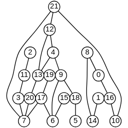

<a name="layeringCoffmanGraham" href="#layeringCoffmanGraham">#</a> d3.**layeringCoffmanGraham**() [<>](https://github.com/erikbrinkman/d3-dag/blob/master/src/sugiyama/layering/coffmanGraham.js#L7 "Source")

Constructs a Coffman-Graham layering accessor with default options.
Assigns every node a layer such that the width, not counting dummy nodes, is always less than some constant.
This can result in tall graphs, but is also reasonably fast.

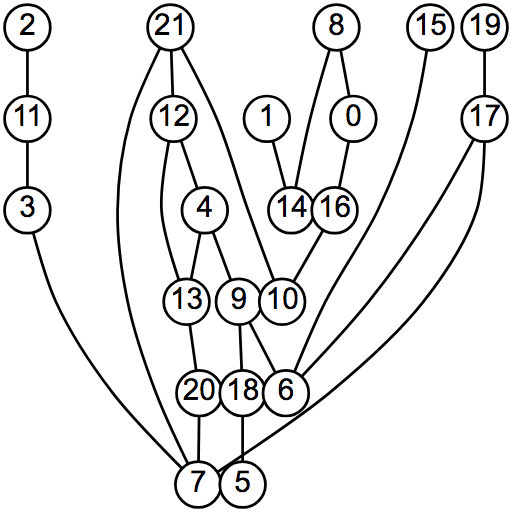

<a name="cg_width" href="#cg_width">#</a> layeringCoffmanGraham.**width**(*width*) [<>](https://github.com/erikbrinkman/d3-dag/blob/master/src/sugiyama/layering/coffmanGraham.js#L65 "Source")

Set the maximum width of any layer.
If set to 0 (the default), the width is set to the rounded square root of the number of nodes.

<a name="layeringSimplex" href="#layeringSimplex">#</a> d3.**layeringSimplex**() [<>](https://github.com/erikbrinkman/d3-dag/blob/master/src/sugiyama/layering/simplex.js#L4 "Source")

Constructs a simplex layering accessor with default options.
Assigns every node a layer such that the number of dummy nodes, nodes inserted on edges that span more than one layer, is minimized.
This is often known as the network simplex layering from [Gansner et al. [1993]](https://www.graphviz.org/Documentation/TSE93.pdf).
This is the most expensive built-in layering assignment accessor.

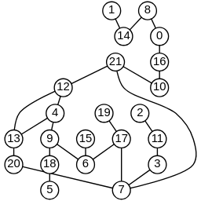

<a name="simp_debug" href="#simp_debug">#</a> layeringSimplex.**debug**(*debug*) [<>](https://github.com/erikbrinkman/d3-dag/blob/master/src/sugiyama/layering/simplex.js#L44 "Source")

Setting *debug* to true will cause the simplex solver to use more human readable names, which can help debug optimizer errors.
These names will cause other types of failures for poorly constructed node ids, and is therefore disabled by default.

<a name="layeringTopological" href="#layeringTopological">#</a> d3.**layeringTopological**() [<>](https://github.com/erikbrinkman/d3-dag/blob/master/src/sugiyama/layering/topological.js#L7 "Source")

Construct a topological layering accessor.
This layering accessor assigns every node a unique layer resulting is extremely tall layouts.
However, when combined with the [*coordTopological*](#coordTopological) coordinate assignment accessor, this can produce pleasing dag layouts.
This is a very fast layering assignment method, but may cause other steps to take lponger due to the introduction of many dummy nodes.

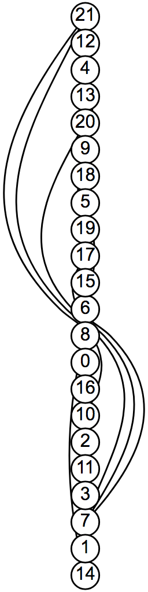


### Sugiyama Decross Accessors

Several built-in decross accessors are provided for use with [*sugiyama*](#sugiyama).
This step is entirely optional, so a noop function can be used to save time, but this will likely result in very ugly layouts.

<a name="decrossOpt" href="#decrossOpt">#</a> d3.**decrossOpt**() [<>](https://github.com/erikbrinkman/d3-dag/blob/master/src/sugiyama/decross/opt.js#L6 "Source")

Construct a an optimal decross accessor with default arguments.
This operator minimized the number of crossings, but does so by solving a mixed-integer linear program (MILP), and may therefore be very slow.

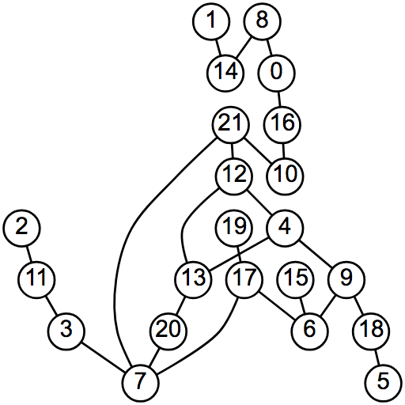

<a name="do_debug" href="#do_debug">#</a> decrossOpt.**debug**(*debug*) [<>](https://github.com/erikbrinkman/d3-dag/blob/master/src/sugiyama/decross/opt.js#L94 "Source")

If set, the variables for the MILP will be given more human readable names, which can help debug optimization errors.
This can cause new optimization errors if the node ids are poorly formed, and is disabled by default.

<a name="decrossTwoLayer" href="#decrossTwoLayer">#</a> d3.**decrossTwoLayer**() [<>](https://github.com/erikbrinkman/d3-dag/blob/master/src/sugiyama/decross/twoLayer.js#L8 "Source")

Construct a two layer decross accessor with default arguments.
The two layer accessor heuristically minimizes the crossings between each layer one at a time by adjusting the positions of the bottom layer.
This can much much faster than using the optimal method.

<a name="tl_order" href="#tl_order">#</a> decrossTwoLayer.**order**(*order*) [<>](https://github.com/erikbrinkman/d3-dag/blob/master/src/sugiyama/decross/twoLayer.js#L16 "Source")

If *order* is specified, sets the order accessor to the specified function and returns this decrossTwoLayer accessor.
If *order* is not specified, returns the current order accessor, which defaults to [*d3.twolayerMedian()*](#twolayerMedian).
A twolayer accessor takes two layers of nodes as arrays, and changes the order of the second layer in order to minimize the number of crossings.

#### Sugiyama Two Layer Accessors

Several built-in twolayer accessors are provided for use with [*decrossTwoLayer*](#decrossTwoLayer).

<a name="twolayerMedian" href="#twolayerMedian">#</a> d3.**twolayerMedian**() [<>](https://github.com/erikbrinkman/d3-dag/blob/master/src/sugiyama/twolayer/median.js#L3 "Source")

Construct a twolayer median accessor.
This accessor orders the bottom layer by the medians of their parents.

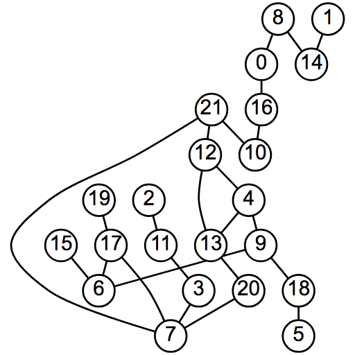

<a name="twolayerMean" href="#twolayerMean">#</a> d3.**twolayerMean**() [<>](https://github.com/erikbrinkman/d3-dag/blob/master/src/sugiyama/twolayer/mean.js#L1 "Source")

Construct a twolayer mean accessor.
This accessor orders the bottom layer by the means of their parents.

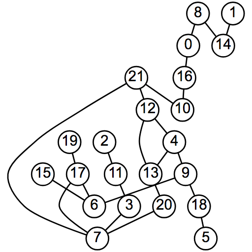

<a name="twolayerOpt" href="#twolayerOpt">#</a> d3.**twolayerOpt**() [<>](https://github.com/erikbrinkman/d3-dag/blob/master/src/sugiyama/twolayer/opt.js#L6 "Source")

Construct a twolayer optimal accessor.
This accessor orders the bottom layer to minimize the number of crossings.
This is done using a MILP, and so will be much slower than the other two layer accessors, but generally faster than the full optimal corssing minimiztion.

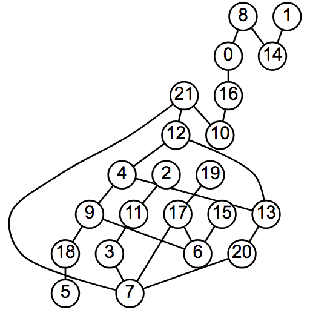

<a name="tlo_debug" href="#tlo_debug">#</a> twolayerOpt.**debug**(*debug*) [<>](https://github.com/erikbrinkman/d3-dag/blob/master/src/sugiyama/twolayer/opt.js#L77 "Source")

If *debug* is specified, sets twolayerOpt to debug to *debug*.
If *debug* is not specified, returns the current debug value, which defaults to false.
If debug is true, the optimization formulation will be given more human readable names that help debugging the optimization, but may cause conflicts if used with poorly chosen node ids.

### Sugiyama Coord Accessors

Several built-in coord accessors are provided for use with [*sugiyama*](#sugiyama).

<a name="coordSpread" href="#coordSpread">#</a> d3.**coordSpread**() [<>](https://github.com/erikbrinkman/d3-dag/blob/master/src/sugiyama/coord/spread.js#L2 "Source")

Construct a spread coordinate accessor.
This accessor positions nodes in each layer so that they are the most spread out.
This coordinate assignment is not particularly pleasing, but it is very fast.

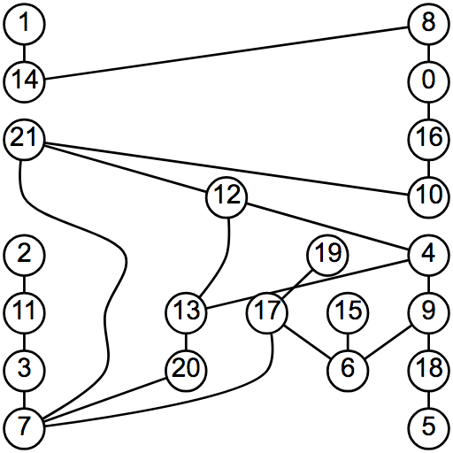

<a name="coordVert" href="#coordVert">#</a> d3.**coordVert**() [<>](https://github.com/erikbrinkman/d3-dag/blob/master/src/sugiyama/coord/vert.js#L4 "Source")

Construct a vertical coordinate accessor.
This accessor positions nodes so that the distance between nodes and the their neightbors is minimized, while the curve through dummy nodes is minimized.
This accessor solves a quadratic program (QP) and so may take significant time, especially as the number of nodes grows.

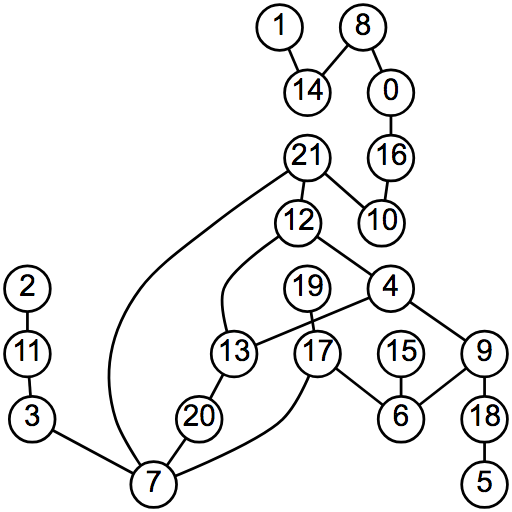

<a name="coordMinCurve" href="#coordMinCurve">#</a> d3.**coordMinCurve**() [<>](https://github.com/erikbrinkman/d3-dag/blob/master/src/sugiyama/coord/minCurve.js#L12 "Source")

Construct a minimum curve accessor.
This accessor weights between minimizing all curves through nodes, and the distance between a node and it's neightbor, including dummy nodes.
This also solves a QP and so is about as performant as [*coordVert*](#coordVert).


<a name="mc_weight" href="#mc_weight">#</a> coordMinCurve.**weight**(*weight*) [<>](https://github.com/erikbrinkman/d3-dag/blob/master/src/sugiyama/coord/minCurve.js#L46 "Source")

If *weight* is specified, sets the weight to the specified number and returns this coordMinCurve accessor.
If *weight* is not specified, returns the current weight, which defaults to 0.5.
Weight must be a value between 0 includive and 1 exclusive.
Heigher weights prioritize minimizing curves more, while lower weights prioritize minimizing child closeness.
Since minimizing only curves is not well defined, weight can not be 1.

<a name="coordGreedy" href="#coordGreedy">#</a> d3.**coordGreedy**() [<>](https://github.com/erikbrinkman/d3-dag/blob/master/src/sugiyama/coord/greedy.js#L5 "Source")

Construct a greedy coordinate accessor.
This accessor assigns coordinates as the mean of their parents and then spaces them out to respect their separation.
Nodes with higher degree that aren't dummy nodes are given higher priority for shifting order, i.e. are less likely to be moved from the mean of their parents.
This solution results in a layout that is more pleaseoing than spread, but much faster to compute than vert or minCurve.

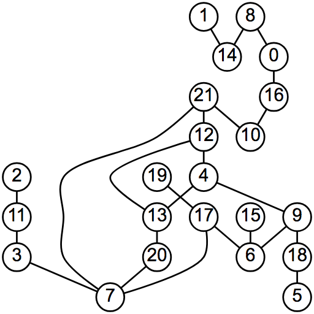

<a name="coordTopological" href="#coordTopological">#</a> d3.**coordTopological**() [<>](https://github.com/erikbrinkman/d3-dag/blob/master/src/sugiyama/coord/topological.js#L4 "Source")

Construct a topological coordinate accessor.
This accessor only works with a topological layering, and minimizes the curve of edges such that all nodes are positioned vertically.
See [*layeringTopological*](#layeringTopological) for an example of what this coordinate assignment looks like.
