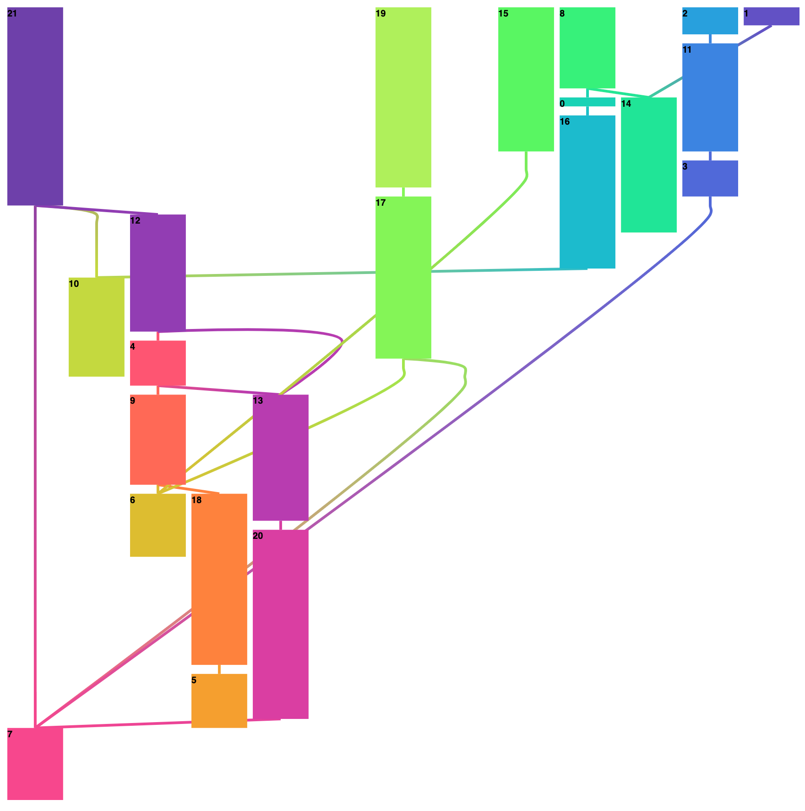
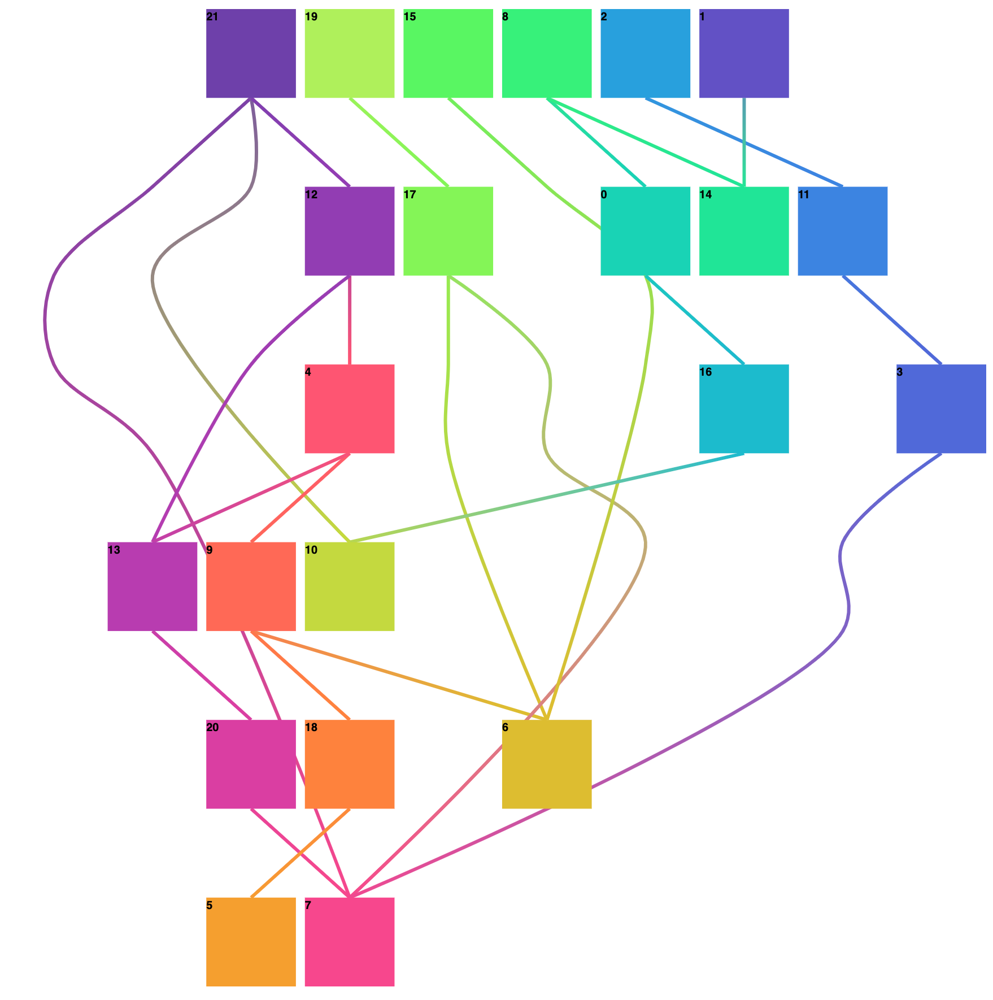
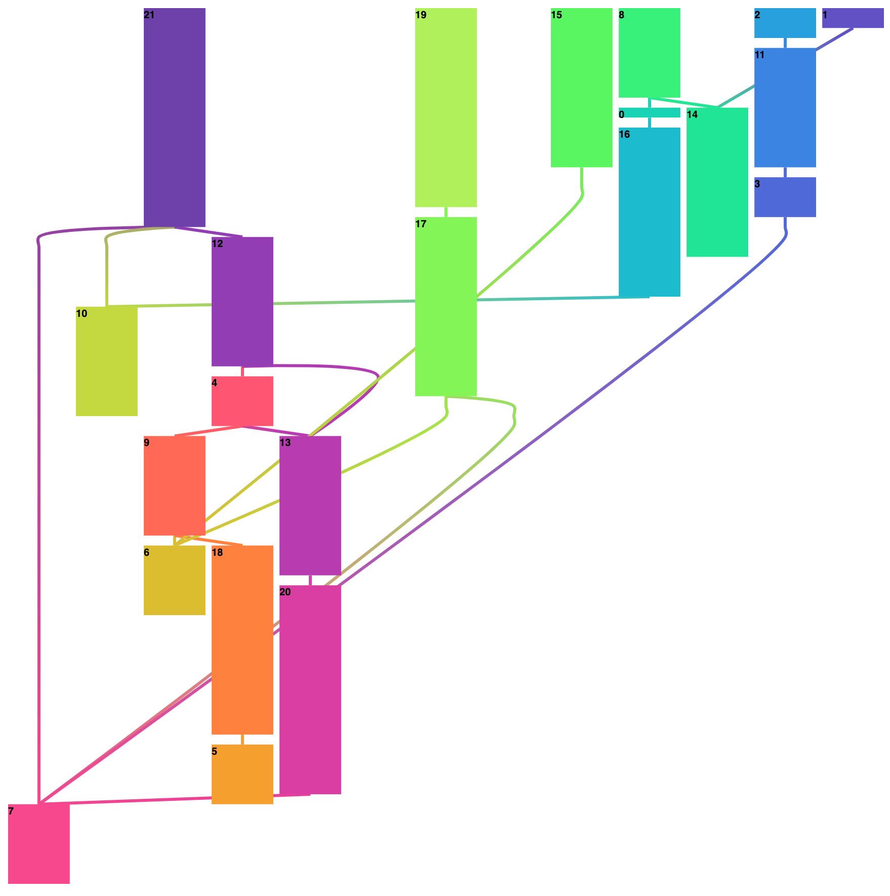

# d3-dag


Often data sets are hierarchical, but are not in a tree structure, such as genetic data.
In these instances `d3-hierarchy` may not suit your needs, which is why `d3-dag` (Directed Acyclic Graph) exists.
This module implements a data structure for manipulating DAGs that mimics the API of `d3-hierarchy` as much as possible, while allowing layouts of acylic DAGs.


## Updating from 0.1 to 0.2

The update from 0.1 to 0.2 includes a few small backwards incompatible changes.

- `dratify` was renamed to `dagStratify` and `dierarchy` was renamed to `dagHierarchy` in order to pollute the d3 namespace less.
- After running a `sugiyama` layout, the `points` attribute will always exist for every links data, and it now also contains the start and end points.
- `coordSpread` was removed in favor of `coordCenter` which produces a slightly better layout in the same amount of time.
- `test/data` was moved to `examples`. This isn't technically part of the api, but it may break examples that required the old file location.
- Link data is created at dag creation time. This also isn't technically backwards compatible but might increase memory consumption.


## Examples

- [Examples with Sugiyama Layout](https://beta.observablehq.com/@erikbrinkman/d3-dag-sugiyama) - Allows you to experiment with different layouts and different datasets for the sugiyama layout.
- [Examples with Topological Layout](https://beta.observablehq.com/@erikbrinkman/d3-dag-topological) - Allows you to experiment with different layouts and different datasets for topological layouts.
- [Example with Arrows](https://observablehq.com/@erikbrinkman/d3-dag-sugiyama-with-arrows) - This example shows a simple, if inexact, way to render edge arrows with d3.


## Installing

If you use NPM, `npm i d3-dag@0.2.3`.
Otherwise you can load it using `unpkg`:

```html
<script src="https://unpkg.com/d3-dag@0.2.3"></script>
<script>

var dag = d3.sugiyama();

</script>
```


## API Reference

* [Hierarchy](#hierarchy)
* [Stratify](#stratify)
* [Connect](#connect)
* [DAG](#dag)
* [Sugiyama](#sugiyama)
* [Zherebko](#zherebko)
* [Arquint](#arquint)


### Hierarchy

Before you can compute a DAG layout, you need a DAG structure.
If your data is already in a DAG structure, you can pass it directly to [`d3.dagHierarchy`](#dagHierarchy); otherwise, you can rearrange tabular data into a DAG using [`d3.dagStratify`](#dagStratify)

<a name="dagHierarchy" href="#dagHierarchy">#</a> d3.**dagHierarchy**() [<>](https://github.com/erikbrinkman/d3-dag/blob/master/src/dag/hierarchy.js#L5 "Source")

Constructs a new hierarchy operator with the default settings.

<a name="_dagHierarchy" href="#_dagHierarchy">#</a> dagHierarchy(...*roots*) [<>](https://github.com/erikbrinkman/d3-dag/blob/master/src/dag/hierarchy.js#L9 "Source")

Construct a DAG from the specified root nodes.
Each root node must be an object representing a root node.
For example:

```json
{
  "id": "Eve",
    "children": [
    {
      "id": "Cain"
    },
    {
      "id": "Seth",
      "children": [
      {
        "id": "Enos"
      },
      {
        "id": "Noam"
      }
      ]
    },
    {
      "id": "Abel"
    },
    {
      "id": "Awan",
      "children": [
      {
        "id": "Enoch"
      }
      ]
    },
    {
      "id": "Azura"
    }
  ]
}
```

The DAG must be connected, i.e. each roots descendants must overlap.
Node ids must be unique, and can't contain the null character `'\0'`.

<a name="dh_id" href="#dh_id">#</a> dagHierarchy.**id**([*id*]) [<>](https://github.com/erikbrinkman/d3-dag/blob/master/src/dag/hierarchy.js#L38 "Source")

If *id* is specified, sets the id accessor to the given function and returns this dagHierarchy operator.
Otherwise, returns the current id accessor, which defaults to:

```js
function id(d) {
  return d.id;
}
```

<a name="children" href="#children">#</a> dagHierarchy.**children**([*children*]) [<>](https://github.com/erikbrinkman/d3-dag/blob/master/src/dag/hierarchy.js#L42 "Source")

If *children* is specified, sets the children accessor to the given function and returns this dagHierarchy operator.
Otherwise, returns the current children accessor, which defaults to:

```js
function children(d) {
  return d.children;
}
```

<a name="dh_linkData" href="#dh_linkData">#</a> dagHierarchy.**linkData**([*linkData*]) [<>](https://github.com/erikbrinkman/d3-dag/blob/master/src/dag/hierarchy.js#L50 "Source")

If *linkData* is specified, sets the linkData accessor to the given function and returns this dagHierarchy operator.
The link data accessor takes the source and target data objects associated with a link and returns an object with data on the link.
Otherwise, returns the current linkData accessor, which defaults to:

```js
function linkData(source, target) {
  return {};
}
```


### Stratify

You can rearrange tabularesque data into a DAG using [`d3.dagStratify`](#dagStratify).

<a name="dagStratify" href="#dagStratify">#</a> d3.**dagStratify**() [<>](https://github.com/erikbrinkman/d3-dag/blob/master/src/dag/stratify.js#L5 "Source")

Constructs a new stratify operator with the default settings.

<a name="_dagStratify" href="#_dagStratify">#</a> dagStratify(data) [<>](https://github.com/erikbrinkman/d3-dag/blob/master/src/dag/stratify.js#L9 "Source")

Construct a dag from the specified *data*.
The data should be an array of data elements that contain info about their parents' ids.
For example:

```json
[
  {
    "id": "Eve"
  },
  {
    "id": "Cain",
    "parentIds": ["Eve"]
  },
  {
    "id": "Seth",
    "parentIds": ["Eve"]
  },
  {
    "id": "Enos",
    "parentIds": ["Seth"]
  },
  {
    "id": "Noam",
    "parentIds": ["Seth"]
  },
  {
    "id": "Abel",
    "parentIds": ["Eve"]
  },
  {
    "id": "Awan",
    "parentIds": ["Eve"]
  },
  {
    "id": "Enoch",
    "parentIds": ["Eve"]
  },
  {
    "id": "Azura",
    "parentIds": ["Eve"]
  }
]
```

<a name="ds_id" href="#ds_id">#</a> dagStratify.**id**([*id*]) [<>](https://github.com/erikbrinkman/d3-dag/blob/master/src/dag/stratify.js#L43 "Source")

If *id* is specified, sets the id accessor to the given function and returns this dagStratify operator.
Otherwise, returns the current id accessor, which defaults to:

```js
function id(d) {
  return d.id;
}
```

<a name="parentIds" href="#parentIds">#</a> dagStratify.**parentIds**([*parentIds*]) [<>](https://github.com/erikbrinkman/d3-dag/blob/master/src/dag/stratify.js#L47 "Source")

If *parentIds* is specified, sets the parentIds accessor to the given function and returns this dagStratify operator.
Otherwise, returns the current parentIds accessor, which defaults to:

```js
function parentIds(d) {
  return d.parentIds;
}
```

<a name="ds_linkData" href="#ds_linkData">#</a> dagStratify.**linkData**([*linkData*]) [<>](https://github.com/erikbrinkman/d3-dag/blob/master/src/dag/stratify.js#L53 "Source")

If *linkData* is specified, sets the linkData accessor to the given function and returns this dagStratify operator.
The linkData accessor takes the source and target data and returns an object with data for the link between them.
Otherwise, returns the current linkData accessor, which defaults to:

```js
function linkData(source, target) {
  return {};
}
```


### Connect

You can rearrange raw edge data into a DAG using [`d3.dagConnect`](#dagConnect).

<a name="dagConnect" href="#dagConnect">#</a> d3.**dagConnect**() [<>](https://github.com/erikbrinkman/d3-dag/blob/master/src/dag/connect.js#L4 "Source")

Constructs a new connect operator with the default settings.

<a name="_dagConnect" href="#_dagconnect">#</a> dagConnect(data) [<>](https://github.com/erikbrinkman/d3-dag/blob/master/src/dag/stratify.js#L8 "Source")

Construct a dag from the specified *data*.
The data should be an array of data elements that contain info about links in the graph.
For example:

```json
[
  ["Eve", "Cain"],
  ["Eve", "Seth"],
  ["Seth", "Enos"],
  ["Seth", "Noam"],
  ["Eve", "Abel"],
  ["Eve", "Awan"]
]
```

<a name="dc_sourceAccessor" href="#ds_sourceAccessor">#</a> dagConnect.**sourceAccessor**([*sourceAccessor*]) [<>](https://github.com/erikbrinkman/d3-dag/blob/master/src/dag/connect.js#L31 "Source")

If *sourceAccessor* is specified, sets the source accessor to the given function and returns this dagConnect operator.
The source accessor takes the link data and returns the source id for the link.
Otherwise, returns the current source accessor, which defaults to:

```js
function sourceAccessor(link) {
  return link[0];
}
```

<a name="dc_targetAccessor" href="#ds_targetAccessor">#</a> dagConnect.**targetAccessor**([*targetAccessor*]) [<>](https://github.com/erikbrinkman/d3-dag/blob/master/src/dag/connect.js#L37 "Source")

If *targetAccessor* is specified, sets the target accessor to the given function and returns this dagConnect operator.
The target accessor takes the link data and returns the target id for the link.
Otherwise, returns the current target accessor, which defaults to:

```js
function targetAccessor(link) {
  return link[1];
}
```

<a name="dc_linkData" href="#ds_linkData">#</a> dagConnect.**linkData**([*linkData*]) [<>](https://github.com/erikbrinkman/d3-dag/blob/master/src/dag/connect.js#L43 "Source")

If *liknData* is specified, sets the linkData accessor to the given function and returns this dagConnect operator.
The linkData accessor takes the link data and returns a data object to use for the link data.
Otherwise, returns the current target accessor, which defaults to:

```js
function targetAccessor(link) {
  return link;
}
```


### DAG

A DAG is simply a collection of nodes, defined by every reachable child node from the current returned node.
If a DAG contains multiple roots, then the returned node will be special in that it will have an `undefined` `id` and `data` and will be ignored when calling normal methods.
Each child of this special returned node will be one of the roots of the DAG.
Each child node on its own will function as a valid DAG with a single root.
Each node has the following properties:

* *node*.id - a unique string identification for each node.
  This is necessary in order to check if two nodes are identical.
  For internal purposes, ids may not contain the null character (`'\0'`).
* *node*.data - the associated data as specified in the constructor.
* *node*.children - an array of all child nodes. Empty if this is a leaf.

Each node also has the following methods.

<a name="descendants" href="#descendants">#</a> node.**descendants**() [<>](https://github.com/erikbrinkman/d3-dag/blob/master/src/dag/descendants.js#L2 "Source")

Return an array of all descendant nodes of this node.

<a name="links" href="#links">#</a> node.**links**( [<>](https://github.com/erikbrinkman/d3-dag/blob/master/src/dag/links.js#2 "Source"))

Returns an array of every link in the DAG.
Each link has the following properties:

* *link*.source - a node that is a parent of target.
* *link*.target - a node that is a child of source.
* *link*.data - an object with data attached to the link.
  Modifying this object will preserve the data for that link.

<a name="copy" href="#copy">#</a> node.**copy**() [<>](https://github.com/erikbrinkman/d3-dag/blob/master/src/dag/index.js#L30 "Source")

Copies the dag structure and returns it.
The data associated with every node is not copied.

<a name="reverse" href="#reverse">#</a> node.**reverse**() [<>](https://github.com/erikbrinkman/d3-dag/blob/master/src/dag/index.js#L55 "Source")

Copy and reverse the DAG, returning a new root or pseudo root depending on if there are multiple roots.
This is particularly useful if you want to use the opposite accessor in DAG creation.
For example, if your data set has childIds, you can use *dagStratify* with parentIds and simply reverse the DAG post creation.

<a name="count" href="#count">#</a> node.**count**( [<>](https://github.com/erikbrinkman/d3-dag/blob/master/src/dag/count.js#L2 "Source"))

Set the *value* of each node to be the number of descendants including itself.

<a name="depth" href="#depth">#</a> node.**depth**() [<>](https://github.com/erikbrinkman/d3-dag/blob/master/src/dag/depth.js#L3 "Source")

Set the *value* of each node to be zero if its a root node, or the greatest distance to any root node for other nodes.

<a name="height" href="#height">#</a> node.**height**() [<>](https://github.com/erikbrinkman/d3-dag/blob/master/src/dag/height.js#L3 "Source")

Set the *value* of each node to be zero if its a leaf node, or the greatest distance to any leaf node for other nodes.

<a name="each" href="#each">#</a> node.**each**(*function*) [<>](https://github.com/erikbrinkman/d3-dag/blob/master/src/dag/eachDepth.js#L5 "Source")

Invoke the specified *function* on each node in an arbitrary order.

<a name="eacha" href="#eacha">#</a> node.**eachAfter**(*function*) [<>](https://github.com/erikbrinkman/d3-dag/blob/master/src/dag/eachAfter.js#L2 "Source")

Invoke the specified *function* on each node such a node is called before any of its parents.

<a name="eachb" href="#eachb">#</a> node.**eachBefore**(*function*) [<>](https://github.com/erikbrinkman/d3-dag/blob/master/src/dag/eachBefore.js#L2 "Source")

Invoke the specified *function* on each node such a node is called before any of its children.

<a name="eachbr" href="#eachbr">#</a> node.**eachBreadth**(*function*) [<>](https://github.com/erikbrinkman/d3-dag/blob/master/src/dag/eachBreadth.js#L4 "Source")

Invoke the specified *function* on each node in breadth first order.

<a name="equals" href="#equals">#</a> node.**equals**(*that*) [<>](https://github.com/erikbrinkman/d3-dag/blob/master/src/dag/equals.js#L21 "Source")

Return `true` if *this* dag is equal to *that* dag.
For two dags to be equal the data must be strictly (`===`) equal.

<a name="every" href="#every">#</a> node.**every**(*function*) [<>](https://github.com/erikbrinkman/d3-dag/blob/master/src/dag/every.js#L4 "Source")

Return `true` if *function* returns true for every node in the DAG.

<a name="some" href="#some">#</a> node.**some**(*function*) [<>](https://github.com/erikbrinkman/d3-dag/blob/master/src/dag/some.js#L4 "Source")

Return `true` if *function* returns true for at least one node in the DAG.

<a name="sum" href="#sum">#</a> node.**sum**(*function*) [<>](https://github.com/erikbrinkman/d3-dag/blob/master/src/dag/sum.js#L2 "Source")

Set the *value* of every node to be the sum of this *functions* return value on the current node's data and the value of every descendant's return value.


### Sugiyama

This constructs a layered representation of the DAG meant for visualization.
The algorithm is based off ideas presented in K. Sugiyama et al. [1979], but described by [S. Hong](http://www.it.usyd.edu.au/~shhong/fab.pdf).
The sugiyama layout can be configured with different algorithms for different stages of the layout.
For each stage there should be adecuate choices for methods that balance speed and quality for your desired layout, but any function that meets the interface for that stage is valid.

<a name="c_sugiyama" href="#c_sugiyama">#</a> d3.**sugiyama**() [<>](https://github.com/erikbrinkman/d3-dag/blob/master/src/sugiyama/index.js#L9 "Source")

Construct a new Sugiyama layout operator with the default settings.

<a name="f_sugiyama" href="#f_sugiyama">#</a> sugiyama(*dag*) [<>](https://github.com/erikbrinkman/d3-dag/blob/master/src/sugiyama/index.js#L59 "Source")

Lays out the specified DAG, assigning the following properties:

* *node*.x - the x-coordinate of the node.
* *node*.y - the y-coordinate of the node.
* *link*.data.points - an array of points for how to draw the edge.
  The first point will always be the same as *source* and the last point will always be the same as *target*.
  Each point has an x and a y property.

<a name="sugi_debug" href="#sugi_debug">#</a> sugiyama.**debug**([*debug*]) [<>](https://github.com/erikbrinkman/d3-dag/blob/master/src/sugiyama/index.js#L90 "Source")

If *debug* is specified, sets sugiyama to debug to *debug*.
If *debug* is not specified, returns the current debug value, which defaults to false.
If debug is true, dummy nodes will be given more human readable ids, but this can cause conflicts with poorly chosen ids, so it it disabled by default.

<a name="sugi_size" href="#sugi_size">#</a> sugiyama.**size**([*size*]) [<>](https://github.com/erikbrinkman/d3-dag/blob/master/src/sugiyama/index.js#L94 "Source")

If *size* is specified, sets this sugiyama layout's size to the specified two-element array of numbers [*width*, *height*] and returns this sugiyama layout.
If *size* is not specified, returns the current layout size, which defaults to [1, 1].

<a name="layering" href="#layering">#</a> sugiyama.**layering**([*layering*]) [<>](https://github.com/erikbrinkman/d3-dag/blob/master/src/sugiyama/index.js#L98 "Source")

If *layering* is specified, sets the layering accessor to the specified function and returns this sugiyama layout.
If *layering* is not specified, returns the current layering accessor, which defaults to [*d3.layeringSimplex()*](#layeringSimplex).
A layering accessor takes a dag and assigns every node a layer attribute from zero to the number of layers - 1.
See [Sugiyama Layering Acessors](#sugiyama-layering-accessors).

<a name="decross" href="#decross">#</a> sugiyama.**decross**([*decross*]) [<>](https://github.com/erikbrinkman/d3-dag/blob/master/src/sugiyama/index.js#L102 "Source")

If *decross* is specified, sets the decross accessor to the specified function and returns this sugiyama layout.
If *decross* is not specified, returns the current decross accessor, which defaults to [*d3.decrossTwoLayer()*](#decrossTwoLayer).
A decross accessor takes a dag as an array of layers where each layer is an array of nodes, and modifies the order of nodes in each layer to reduce the number of link crossings.
See [Sugiyama Decross Acessors](#sugiyama-decross-accessors).

<a name="coord" href="#coord">#</a> sugiyama.**coord**([*coord*]) [<>](https://github.com/erikbrinkman/d3-dag/blob/master/src/sugiyama/index.js#L106 "Source")

If *coord* is specified, sets the coord accessor to the specified function and returns this sugiyama layout.
If *coord* is not specified, returns the current coord accessor, which defaults to [*d3.coordGreedy()*](#coordGreedy).
A coord accessor takes a dag as an array of layers where each layer is an array of nodes and a separation function, which takes adjacent nodes and specifies their relative separation.
The coord accessor assigns every node an x property in [0, 1] to specify the actual layout.
See [Sugiyama Coord Acessors](#sugiyama-coord-accessors).

<a name="separation" href="#separation">#</a> sugiyama.**separation**([*separation*]) [<>](https://github.com/erikbrinkman/d3-dag/blob/master/src/sugiyama/index.js#L110 "Source")

If *separation* is specified, sets the separation accessor to the specified function and returns this sugiyama layout.
If *separation* is not specified, returns the current separation accessor, which defaults to:

```js
function separation(a, b) {
  return 1;
}
```

The separation accessor function takes two adjacent dag nodes and sets their relative separation, thus any constant function will produce the same results.
Another other common setting is:

```js
function separation(a, b) {
  return (a.data !== undefined) + (b.data !== undefined);
}
```

which will wrap edges around nodes, but give them no spaceing themselves.


### Sugiyama Layering Accessors

Several built-in layering accessors are provided for use with [*sugiyama*](#sugiyama).

<a name="layeringLongestPath" href="#layeringLongestPath">#</a> d3.**layeringLongestPath**() [<>](https://github.com/erikbrinkman/d3-dag/blob/master/src/sugiyama/layering/longestPath.js#L2 "Source")

Construct a longest path layering accessor.
This layering accessor assigns every node a layer such that the longest path (the height) is minimized.
This often results in very wide graphs, but is fast.


<a name="lp_topDown" href="#lp_topDown">#</a> layeringLongestPath.**topDown**(*topDown*) [<>](https://github.com/erikbrinkman/d3-dag/blob/master/src/sugiyama/layering/longestPath.js#L17 "Source")

Set whether longest path should go top down or not.
If set to true (the default), longest path will start at the top, putting only nodes that need to be at hte top layer, otherwise it will put as many nodes as possible in the top layer.

<a name="layeringCoffmanGraham" href="#layeringCoffmanGraham">#</a> d3.**layeringCoffmanGraham**() [<>](https://github.com/erikbrinkman/d3-dag/blob/master/src/sugiyama/layering/coffmanGraham.js#L7 "Source")

Constructs a Coffman-Graham layering accessor with default options.
Assigns every node a layer such that the width, not counting dummy nodes, is always less than some constant.
This can result in tall graphs, but is also reasonably fast.


<a name="cg_width" href="#cg_width">#</a> layeringCoffmanGraham.**width**(*width*) [<>](https://github.com/erikbrinkman/d3-dag/blob/master/src/sugiyama/layering/coffmanGraham.js#L65 "Source")

Set the maximum width of any layer.
If set to 0 (the default), the width is set to the rounded square root of the number of nodes.

<a name="layeringSimplex" href="#layeringSimplex">#</a> d3.**layeringSimplex**() [<>](https://github.com/erikbrinkman/d3-dag/blob/master/src/sugiyama/layering/simplex.js#L4 "Source")

Constructs a simplex layering accessor with default options.
Assigns every node a layer such that the number of dummy nodes, nodes inserted on edges that span more than one layer, is minimized.
This is often known as the network simplex layering from [Gansner et al. [1993]](https://www.graphviz.org/Documentation/TSE93.pdf).
This is the most expensive built-in layering assignment accessor.


<a name="simp_debug" href="#simp_debug">#</a> layeringSimplex.**debug**(*debug*) [<>](https://github.com/erikbrinkman/d3-dag/blob/master/src/sugiyama/layering/simplex.js#L44 "Source")

Setting *debug* to true will cause the simplex solver to use more human readable names, which can help debug optimizer errors.
These names will cause other types of failures for poorly constructed node ids, and is therefore disabled by default.

<a name="layeringTopological" href="#layeringTopological">#</a> d3.**layeringTopological**() [<>](https://github.com/erikbrinkman/d3-dag/blob/master/src/sugiyama/layering/topological.js#L7 "Source")

Construct a topological layering accessor.
This layering accessor assigns every node a unique layer resulting is extremely tall layouts.
However, when combined with the [*coordTopological*](#coordTopological) coordinate assignment accessor, this can produce pleasing dag layouts.
This is a very fast layering assignment method, but may cause other steps to take lponger due to the introduction of many dummy nodes.


### Sugiyama Decross Accessors

Several built-in decross accessors are provided for use with [*sugiyama*](#sugiyama).
This step is entirely optional, so a noop function can be used to save time, but this will likely result in very ugly layouts.

<a name="decrossOpt" href="#decrossOpt">#</a> d3.**decrossOpt**() [<>](https://github.com/erikbrinkman/d3-dag/blob/master/src/sugiyama/decross/opt.js#L6 "Source")

Construct a an optimal decross accessor with default arguments.
This operator minimized the number of crossings, but does so by solving a mixed-integer linear program (MILP), and may therefore be very slow.


<a name="do_debug" href="#do_debug">#</a> decrossOpt.**debug**(*debug*) [<>](https://github.com/erikbrinkman/d3-dag/blob/master/src/sugiyama/decross/opt.js#L94 "Source")

If set, the variables for the MILP will be given more human readable names, which can help debug optimization errors.
This can cause new optimization errors if the node ids are poorly formed, and is disabled by default.

<a name="decrossTwoLayer" href="#decrossTwoLayer">#</a> d3.**decrossTwoLayer**() [<>](https://github.com/erikbrinkman/d3-dag/blob/master/src/sugiyama/decross/twoLayer.js#L8 "Source")

Construct a two layer decross accessor with default arguments.
The two layer accessor heuristically minimizes the crossings between each layer one at a time by adjusting the positions of the bottom layer.
This can much much faster than using the optimal method.

<a name="tl_order" href="#tl_order">#</a> decrossTwoLayer.**order**(*order*) [<>](https://github.com/erikbrinkman/d3-dag/blob/master/src/sugiyama/decross/twoLayer.js#L16 "Source")

If *order* is specified, sets the order accessor to the specified function and returns this decrossTwoLayer accessor.
If *order* is not specified, returns the current order accessor, which defaults to [*d3.twolayerMedian()*](#twolayerMedian).
A twolayer accessor takes two layers of nodes as arrays, and changes the order of the second layer in order to minimize the number of crossings.

#### Sugiyama Two Layer Accessors

Several built-in twolayer accessors are provided for use with [*decrossTwoLayer*](#decrossTwoLayer).

<a name="twolayerMedian" href="#twolayerMedian">#</a> d3.**twolayerMedian**() [<>](https://github.com/erikbrinkman/d3-dag/blob/master/src/sugiyama/twolayer/median.js#L3 "Source")

Construct a twolayer median accessor.
This accessor orders the bottom layer by the medians of their parents.


<a name="twolayerMean" href="#twolayerMean">#</a> d3.**twolayerMean**() [<>](https://github.com/erikbrinkman/d3-dag/blob/master/src/sugiyama/twolayer/mean.js#L1 "Source")

Construct a twolayer mean accessor.
This accessor orders the bottom layer by the means of their parents.

<a name="twolayerOpt" href="#twolayerOpt">#</a> d3.**twolayerOpt**() [<>](https://github.com/erikbrinkman/d3-dag/blob/master/src/sugiyama/twolayer/opt.js#L6 "Source")

Construct a twolayer optimal accessor.
This accessor orders the bottom layer to minimize the number of crossings.
This is done using a MILP, and so will be much slower than the other two layer accessors, but generally faster than the full optimal corssing minimiztion.


<a name="tlo_debug" href="#tlo_debug">#</a> twolayerOpt.**debug**(*debug*) [<>](https://github.com/erikbrinkman/d3-dag/blob/master/src/sugiyama/twolayer/opt.js#L77 "Source")

If *debug* is specified, sets twolayerOpt to debug to *debug*.
If *debug* is not specified, returns the current debug value, which defaults to false.
If debug is true, the optimization formulation will be given more human readable names that help debugging the optimization, but may cause conflicts if used with poorly chosen node ids.

### Sugiyama Coord Accessors

Several built-in coord accessors are provided for use with [*sugiyama*](#sugiyama).

<a name="coordCenter" href="#coordCenter">#</a> d3.**coordCenter**() [<>](https://github.com/erikbrinkman/d3-dag/blob/master/src/sugiyama/coord/center.js#L2 "Source")

Construct a center coordinate accessor.
This accessor keeps spread every node apart by separation and then centers each layer.
The result isn't a particularly great distribution of nodes, but it doesn't require any type of optimization, and so is very fast.


<a name="coordVert" href="#coordVert">#</a> d3.**coordVert**() [<>](https://github.com/erikbrinkman/d3-dag/blob/master/src/sugiyama/coord/vert.js#L4 "Source")

Construct a vertical coordinate accessor.
This accessor positions nodes so that the distance between nodes and the their neightbors is minimized, while the curve through dummy nodes is minimized.
This accessor solves a quadratic program (QP) and so may take significant time, especially as the number of nodes grows.


<a name="coordMinCurve" href="#coordMinCurve">#</a> d3.**coordMinCurve**() [<>](https://github.com/erikbrinkman/d3-dag/blob/master/src/sugiyama/coord/minCurve.js#L12 "Source")

Construct a minimum curve accessor.
This accessor weights between minimizing all curves through nodes, and the distance between a node and it's neightbor, including dummy nodes.
This also solves a QP and so is about as performant as [*coordVert*](#coordVert).


<a name="mc_weight" href="#mc_weight">#</a> coordMinCurve.**weight**(*weight*) [<>](https://github.com/erikbrinkman/d3-dag/blob/master/src/sugiyama/coord/minCurve.js#L46 "Source")

If *weight* is specified, sets the weight to the specified number and returns this coordMinCurve accessor.
If *weight* is not specified, returns the current weight, which defaults to 0.5.
Weight must be a value between 0 includive and 1 exclusive.
Heigher weights prioritize minimizing curves more, while lower weights prioritize minimizing child closeness.
Since minimizing only curves is not well defined, weight can not be 1.

<a name="coordGreedy" href="#coordGreedy">#</a> d3.**coordGreedy**() [<>](https://github.com/erikbrinkman/d3-dag/blob/master/src/sugiyama/coord/greedy.js#L5 "Source")

Construct a greedy coordinate accessor.
This accessor assigns coordinates as the mean of their parents and then spaces them out to respect their separation.
Nodes with higher degree that aren't dummy nodes are given higher priority for shifting order, i.e. are less likely to be moved from the mean of their parents.
This solution results in a layout that is more pleaseoing than spread, but much faster to compute than vert or minCurve.


<a name="coordTopological" href="#coordTopological">#</a> d3.**coordTopological**() [<>](https://github.com/erikbrinkman/d3-dag/blob/master/src/sugiyama/coord/topological.js#L4 "Source")

Construct a topological coordinate accessor.
This accessor only works with a topological layering, and minimizes the curve of edges such that all nodes are positioned vertically.
See [*layeringTopological*](#layeringTopological) for an example of what this coordinate assignment looks like.


### Zherebko

This constructs a topological representation of the DAG meant for visualization.
The algorithm is based off a PR by D. Zherebko.
The nodes are topologically ordered, and edges are positioned into "lanes" to the left and right of the nodes.

<a name="c_zherebko" href="#c_zherebko">#</a> d3.**zherebko**() [<>](https://github.com/erikbrinkman/d3-dag/blob/master/src/zherebko/index.js#L6 "Source")

Construct a new Zherebko layout operator with the default settings.

<a name="f_zherebko" href="#f_zherebko">#</a> zherebko(*dag*) [<>](https://github.com/erikbrinkman/d3-dag/blob/master/src/zherebko/index.js#L11 "Source")

Lays out the specified DAG, assigning the following properties:

* *node*.x - the x-coordinate of the node.
* *node*.y - the y-coordinate of the node.
* *link*.data.points - an array of points for how to draw the edge.
  The first point will always be the same as *source* and the last point will always be the same as *target*.
  Each point has an x and a y property.
  


<a name="sugi_size" href="#sugi_size">#</a> zherebko.**size**([*size*]) [<>](https://github.com/erikbrinkman/d3-dag/blob/master/src/zherebko/index.js#L52 "Source")

If *size* is specified, sets this zherebko layout's size to the specified two-element array of numbers [*width*, *height*] and returns this zherebko layout.
If *size* is not specified, returns the current layout size, which defaults to [1, 1].


### Arquint

This treats nodes not as points (i.e. producing x & y coordinates) but as rectangles.
Each node has a property *heightRatio* specifying its height in comparison to other nodes.
The algorithm is based off a PR by L. Arquint.

<a name="c_arquint" href="#c_arquint">#</a> d3.**arquint**() [<>](https://github.com/erikbrinkman/d3-dag/blob/master/src/arquint/index.js#L7 "Source")

Construct a new Arquint layout operator with the default settings.

<a name="f_arquint" href="#f_arquint">#</a> arquint(*dag*) [<>](https://github.com/erikbrinkman/d3-dag/blob/master/src/arquint/index.js#L139 "Source")

Lays out the specified DAG while respecting (vertical) *node*.heightRatio together with (vertical) [*inter layer separation*](#arquint_interLayerSeparation), (horizontal) [*column width*](#arquint_columnWidth), as well as (horizontal) [*column separation*](#arquint_columnSeparation).
It assigns the following properties:

* *node*.x0 - the left x-coordinate of the node.
* *node*.x1 - the right x-coordinate of the node.
* *node*.y0 - the bottom y-coordinate of the node.
* *node*.y1 - the top y-coordinate of the node.
* *link*.data.points - an array of points for how to draw the edge.
  The first point will always be the same as *source* and the last point will always be the same as *target*.
  Each point has an x and a y property, that corresponds to the bottom (*source*) resp. top (*target*) center of the node.

In the following example, the default options were used and *node*.heightRatio was set to Number(*node*.id)+1:


<a name="arquint_size" href="#arquint_size">#</a> arquint.**size**([*size*]) [<>](https://github.com/erikbrinkman/d3-dag/blob/master/src/arquint/index.js#L199 "Source")

If *size* is specified, sets this arquint layout's size to the specified two-element array of numbers [*width*, *height*] and returns this arquint layout.
If *size* is not specified, returns the current layout size, which defaults to [1, 1].

<a name="arquint_layering" href="#arquint_layering">#</a> arquint.**layering**([*layering*]) [<>](https://github.com/erikbrinkman/d3-dag/blob/master/src/arquint/index.js#L205 "Source")

If *layering* is specified, sets the layering accessor to the specified function and returns this arquint layout.
If *layering* is not specified, returns the current layering accessor, which defaults to [*d3.layeringLongestPath().topDown(false)*](#layeringLongestPath).
A layering accessor takes a dag and assigns every node a layer attribute from zero to the number of layers - 1.
See [Sugiyama Layering Acessors](#sugiyama-layering-accessors).

<a name="arquint_decross" href="#arquint_decross">#</a> arquint.**decross**([*decross*]) [<>](https://github.com/erikbrinkman/d3-dag/blob/master/src/arquint/index.js#L211 "Source")

If *decross* is specified, sets the decross accessor to the specified function and returns this arquint layout.
If *decross* is not specified, returns the current decross accessor, which defaults to [*d3.decrossTwoLayer()*](#decrossTwoLayer).
A decross accessor takes a dag as an array of layers where each layer is an array of nodes, and modifies the order of nodes in each layer to reduce the number of link crossings.
See [Sugiyama Decross Acessors](#sugiyama-decross-accessors).

<a name="arquint_columnAssignment" href="#arquint_columnAssignment">#</a> arquint.**columnAssignment**([*columnAssignment*]) [<>](https://github.com/erikbrinkman/d3-dag/blob/master/src/arquint/index.js#L217 "Source")

If *columnAssignment* is specified, sets the column accessor to the specified function and returns this arquint layout.
If *columnAssignment* is not specified, returns the current column accessor, which defaults to [*d3.columnComplex()*](#columnComplex).
A column accessor takes a dag as an array of layers where each layer is an array of nodes, and sets *node*.columnIndex to the index of the column in which it should appear.
See [Arquint Column Accessors](#arquint-column-accessors).

<a name="coord" href="#coord">#</a> arquint.**coord**([*coord*]) [<>](https://github.com/erikbrinkman/d3-dag/blob/master/src/arquint/index.js#L223 "Source")

If *coord* is specified, sets the coord accessor to the specified function and returns this arquint layout.
If *coord* is not specified, returns the current coord accessor, which defaults to [*d3.coordRect()*](#coordRect).
A coord accessor takes a dag as an array of layers where each layer is an array of nodes, a [column width function](#arquint_columnWidth) and a [column separation function](#arquint_columnSeparation).
The coord accessor assigns every node an x0 and x1 property in [0, 1] to specify the actual layout.
See [Arquint Coord Acessors](#arquint-coord-accessors).

<a name="arquint_interLayerSeparation" href="#arquint_interLayerSeparation">#</a> arquint.**interLayerSeparation**([*interLayerSeparation*]) [<>](https://github.com/erikbrinkman/d3-dag/blob/master/src/arquint/index.js#L229 "Source")

If *interLayerSeparation* is specified, sets the inter layer accessor to the specified function and returns this arquint layout.
If *interLayerSeparation* is not specified, returns the current inter layer accessor, which defaults to *1*.
A inter layer accessor takes a layer (i.e. an array of nodes) and its index and returns the relative distance to the previous layer. It is not called for the first layer, because it does not have a previous layer.

<a name="arquint_columnWidth" href="#arquint_columnWidth">#</a> arquint.**columnWidth**([*columnWidth*]) [<>](https://github.com/erikbrinkman/d3-dag/blob/master/src/arquint/index.js#L235 "Source")

If *columnWidth* is specified, sets the column width accessor to the specified function and returns this arquint layout.
If *columnWidth* is not specified, returns the current column width accessor, which defaults to *10*.
A column width accessor takes a column index and returns the relative width of the column.

<a name="arquint_columnSeparation" href="#arquint_columnSeparation">#</a> arquint.**columnSeparation**([*columnSeparation*]) [<>](https://github.com/erikbrinkman/d3-dag/blob/master/src/arquint/index.js#L241 "Source")

If *columnSeparation* is specified, sets the column separation accessor to the specified function and returns this arquint layout.
If *columnSeparation* is not specified, returns the current column separation accessor, which defaults to *1*.
A column separation accessor takes a column index and returns the relative distance to the next column.


### Arquint Column Accessors

Several built-in column accessors are provided for use with [*arquint*](#arquint).

<a name="arquint_columnSimpleLeft" href="#arquint_columnSimpleLeft">#</a> d3.**columnSimpleLeft**() [<>](https://github.com/erikbrinkman/d3-dag/blob/master/src/arquint/column/simpleLeft.js "Source")

Constructs a column simple left accessor.
For each layer, this accessor assigns each node to a column starting from the left side.
Due to the layer local decision process, nodes can overlap if nodes in different layers have different heights.
Therefore, the following example sets *node*.heightRatio to 1 for all nodes:


<a name="arquint_columnSimpleCenter" href="#arquint_columnSimpleCenter">#</a> d3.**columnSimpleCenter**() [<>](https://github.com/erikbrinkman/d3-dag/blob/master/src/arquint/column/simpleCenter.js "Source")

Constructs a column simple center accessor.
For each layer, this accessor assigns each node to a column while centering them (per-layer).
Due to the layer local decision process, nodes can overlap if nodes in different layers have different heights.
Therefore, the following example sets *node*.heightRatio to 1 for all nodes:



<a name="arquint_columnAdjacent" href="#arquint_columnAdjacent">#</a> d3.**columnAdjacent**() [<>](https://github.com/erikbrinkman/d3-dag/blob/master/src/arquint/column/adjacent.js "Source")

Constructs a column adjacent accessor.
Assigns column indices to the layer with most nodes first.
Afterwards starting from the layer with most nodes, column indices are assigned to nodes in adjacent layers. 
Column indices are assigned with respect to the node's parents or children while maintaining the same ordering in the layer.
In comparison to [columnSimpleLeft](#arquint_columnSimpleLeft) and [columnSimpleCenter](#arquint_columnSimpleCenter), this accessor takes the adjacent layer into account and tries to assign a column index that is near the column index of the child or parent.
Because nodes can be placed in the same column even though they do not have a children/parents relation with each other, nodes can overlap if nodes in different layers have different heights.
Therefore, the following example sets *node*.heightRatio to 1 for all nodes:


<a name="arquint_ca_center" href="#arquint_ca_center">#</a> columnAdjacent.**center**(*center*) [<>](https://github.com/erikbrinkman/d3-dag/blob/master/src/arquint/column/adjacent.js#L119 "Source")

Set whether the column adjacent accessor should center the adjacent node. It defaults to false.
For the particular example with default options, this property has no influence and results in the exact same graph.

<a name="arquint_columnComplex" href="#arquint_columnComplex">#</a> d3.**columnComplex**() [<>](https://github.com/erikbrinkman/d3-dag/blob/master/src/arquint/column/complex.js "Source")

Constructs a column complex accessor.
Instead of doing the assignment of nodes to columns per-layer, this accessor considers the entire subtree per node.
Therefore, the assignment happens depth-first.


<a name="arquint_cc_center" href="#arquint_cc_center">#</a> columnComplex.**center**(*center*) [<>](https://github.com/erikbrinkman/d3-dag/blob/master/src/arquint/column/complex.js#L56 "Source")

Set whether the column complex accessor should center the parent node for each subtree. It defaults to false.




### Arquint Coord Acessors

Currently only a single coord accessor is provided for use with [*arquint*](#arquint).

<a name="coordRect" href="#coordRect">#</a> d3.**coordRect**() [<>](https://github.com/erikbrinkman/d3-dag/blob/master/src/arquint/coord/coordRect.js#L6 "Source")

Construct a coordinate accessor for rectangles.
This accessor assigns x0 and x1 coordinates to each node based on their layering and columnIndex.
Furthermore, [*columnWidth*](#arquint_columnWidth) and [*columnSeparation*](#arquint_columnSeparation) are used to calculate the width of each column (and hence the width of nodes in that column) resp. the distance between columns.
